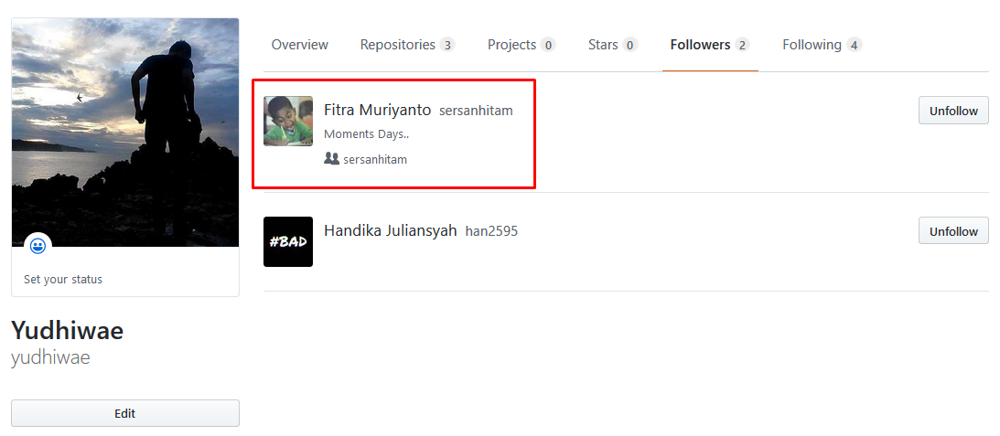

# tcclanjut

# Berkontribusi pada Open Source di Github ( pull request )

1. Yang pertama dilakukan adalah mencari teman atau partner untuk berkolaborasi atau para pengembang di pusat bahwa kita memiliki perubahan yang ingin dikirimkan ke mereka.

2. Fork & Clone Repository
Langkah selanjutnya adalah melakukan fork repository ke akun kita.

Frok bisa kita artikan sebagai menyalin repository dari akun orang lain atau organisasi ke akun kita sendiri.

Nah untuk memprektek, saya sudah menyapkan proyek bernama tcclanjut-1.

Silahkan buka proyek tersebut, lalu klik tombol Fork.

3. Sekarang repository tcclanjut-1 telah menjadi milik kita dan bebas melakukan apapun terhadapnya.

Selanjutnya silahkan clone (download) repository tersebut ke komputer lokal.

 

4. Lakukan Modifikasi

Setelah kita melakukan clone ke komputer lokal, selanjutnya buka dengan teks editor dan lakukan modifikasi.

5. Mendaftarkan perubahan sebelum commit

6. Melakukan commit terhadap apa yang sudah dirubah.

7.Push Kontribusi

Setelah selesai melakukan perubahan dan commit, langkah berikutnya adalah melakukan push.

8. Membuat Pull Request

Pull Request adalah istilah yang bisa diartikan sebagai permintaan untuk menggabungkan kode.

Kita sudah membuat perubahan di repository hasil fork, lalu ingin menggabungkan dengan repository sumber.

Maka harus membuat Pull Request.

Silahkan klik tombol New Pull Request pada repository tcclanjut-1.

Setelah itu, Github akan melakukan komparasi.

Apakah ada kode yang bentrok atau tidak?

Kalau tidak ada yang bentrok akan muncul tulisan hijau “Able to merge”.

Selanjutnya klik tombol Create Pull Request.

mengisi judul Pull Request dan pesan yang ingin disampaikan ke komunitas.

Setelah itu admin atau owner akan melakukan review kontribusimu.

Biasanya akan terjadi diskusi untuk membahas pull request yang telah buat.

Apakah akan ditolak atau diterima?

Kalau diterima, biasanya akan ada tulisan “Marged” berwarna ungu.

