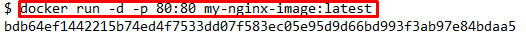

##1 - Base Images

## Task
Creating a Dockerfile
The first line of the Dockerfile should be FROM nginx:1.11-alpine
Make the change in the Dockerfile editor. Within the environment, a new Dockerfile will be created with the contents of the editor.

##2 - Configure Base Image

## Task
A new index.html file has been created for you which we want to serve from our container. On the next line after the FROM command, use the COPY command to copy index.html into a directory called /usr/share/nginx/html

##3 - Exposing Ports

Task
We want our web server to be accessible via port 80, add the relevant EXPOSE line to the Dockerfile.

##4 - Default Commands

With the Docker image configured and having defined which ports we want accessible, we now need to define the command that launches the application.
The CMD line in a Dockerfile defines the default command to run when a container is launched. If the command requires arguments then it's recommended to use an array, for example ["cmd", "-a", "arga value", "-b", "argb-value"], which will be combined together and the command cmd -a "arga value" -b argb-value would be run.

##Task
The command to run NGINX is nginx -g daemon off;. Set this as the default command in the Dockerfile.

##5 - Building Containers

After writing your Dockerfile you need to use docker build to turn it into an image. The build command takes in a directory containing the Dockerfile, executes the steps and stores the image in your local Docker Engine. If one fails because of an error then the build stops.

##Task
Using the docker build command to build the image. You can give the image a friendly name by using the -t <name> option.

##6 - Launching New Image

With the image successfully created, you can now launch the container in the same way we described in the first scenario.

Task
Launch an instance of your newly built image using either the ID result from the build command or the friendly name you assigned it.
NGINX is designed to run as a background service so you should include the option -d. To make the web server accessible, bind it to port 80 using p 80:80

For example:
docker run -d -p 80:80 <image-id|friendly-tag-name>

You can access the launched web server via the hostname docker. After launching the container, the command curl -i http://docker will return our index file via NGINX and the image we built.

##Protip
You can check the container is running using docker ps

[<Back](README.md)
