# Membuat Container

1. Pertama adalah mengidentifikasi nama Docker Image yang dikonfigurasi untuk menjalankan Redis. 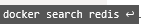

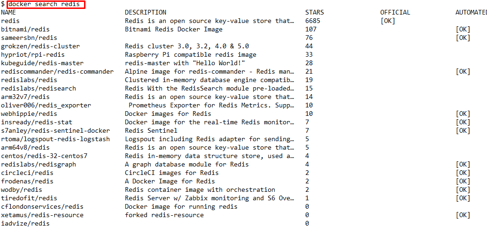

Menjalankan image redis yg baru saja di pull. 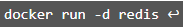

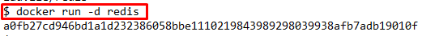

2. Menampilkan container yang berjalan. 

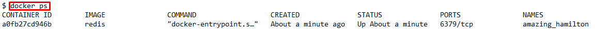

3. Menjalankan image redis dengan merubah / memindahkan pada port 6379. 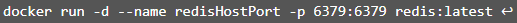

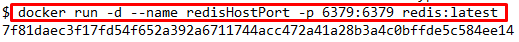

4. Membuat port dinamis pada image redis yang telah di akses.

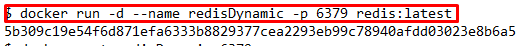

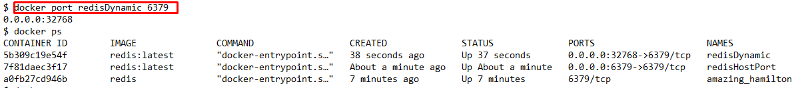

5. Maping direktori pada localhost

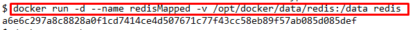

7. Menjalankan Image ubuntu pada foreground

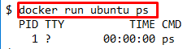

8. Menjalankan bash

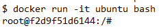

[<Back](README.md)

