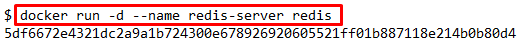
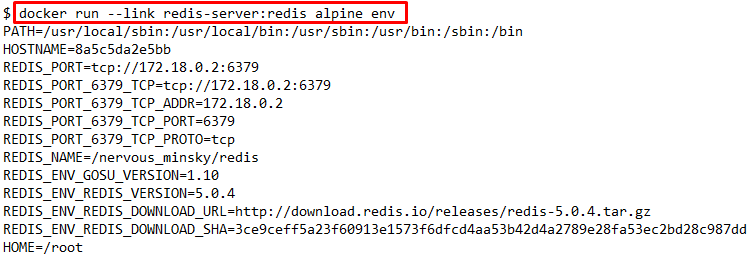
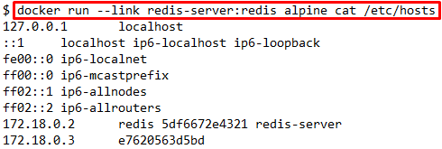
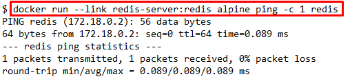
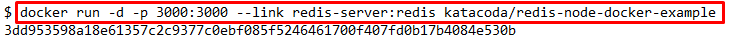
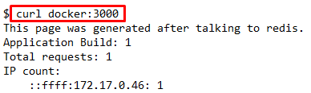
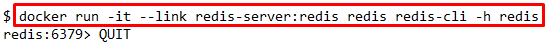

## 1 - Start Redis

## Redis
Redis is a fast, open source, key-value data store.

The most common scenario for connecting to containers is an application connecting to a data-store. The key aspect when creating a link is the name of the container. All containers have names, but to make it easier when working with links, it's important to define a friendly name of the source container which you're connecting to.

## Start Data Store
Run a redis server with a friendly name of redis-server which we'll connect to in the next step. This will be our source container.

## 2 - Create Link

To connect to a source container you use the --link <container-name|id>:<alias> option when launching a new container. The container name refers to the source container we defined in the previous step while the alias defines the friendly name of the host.

By setting an alias we separate how our application is configured to how the infrastructure is called. This means the application configuration doesn't need to change as it's connected to other environments.

## How Links Work
In this example, we bring up a Alpine container which is linked to our redis-server. We've defined the alias as redis. When a link is created, Docker will do two things.
First, Docker will set some environment variables based on the linked to the container. These environment variables give you a way to reference information such as Ports and IP addresses via known names.

You can output all the environment variables with the env command.

Secondly, Docker will update the HOSTS file of the container with an entry for our source container with three names, the original, the alias and the hash-id. You can output the containers host entry using cat /etc/hosts

## Example
With a link created you can ping the source container in the same way as if it were a server running in your network.

## 3 - Connect To App

With a link created, applications can connect and communicate with the source container in the usual way, independent of the fact both services are running in containers.

## Example Application
Here is a simple node.js application which connects to redis using the hostname redis.

## Test Connection
Sending an HTTP request to the application will store the request in Redis and return a count. If you issue multiple requests, you'll see the counter increment as items are persisted.

## 4 - Connect to Redis CLI

In the same way, you can connect source containers to applications, you can also connect them to their own CLI tools.

## Launching Redis CLI
The command below will launch an instance of the Redis-cli tool and connect to the redis server via its alias.

## Issuing Commands
The command KEYS * will output the contents stored currently in the source redis container.

Type QUIT to exit the CLI.