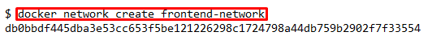
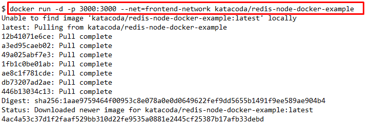
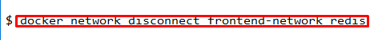

# Docker Networks

## 1 - Create Network

The first step is to create a network using the CLI. This network will allow us to attach multiple containers which will be able to discover each other.

## Create Network

To start with we create the network with our predefined name. 

## Connect To Network

When we launch new containers, we can use the --net attribute to assign which network they should be connected to. 

## 2 - Network Communication

Unlike using links, docker network behave like traditional networks where nodes can be attached/detached.

Instead, the way containers can communicate via an Embedded DNS Server in Docker. This DNS server is assigned to all containers via the IP 127.0.0.11 and set in the resolv.conf file.

When containers attempt to access other containers via a well-known name, such as Redis, the DNS server will return the IP address of the correct Container. In this case, the fully qualified name of Redis will be redis.

## 3 - Connect Two Containers

Docker supports multiple networks and containers being attached to more than one network at a time.

For example, let's create a separate network with a Node.js application that communicates with our existing Redis instance.

The first task is to create a new network in the same way.

When using the connect command it is possible to attach existing containers to the network.

When we launch the web server, given it's attached to the same network it will be able to communicate with our Redis instance.

Test it using

## 4 - Create Aliases

Links are still supported when using docker network and provide a way to define an Alias to the container name. This will give the container an extra DNS entry name and way to be discovered. When using --link the embedded DNS will guarantee that localised lookup result only on that container where the --link is used.

## Connect Container with Alias.
The following command will connect our Redis instance to the frontend-network with the alias of db.

When containers attempt to access a service via the name db, they will be given the IP address of our Redis container.

## 5 - Disconnect Containers

With our networks created, we can use the CLI to explore the details.

The following command will list all the networks on our host.

We can then explore the network to see which containers are attached and their IP addresses.

The following command disconnects the redis container from the frontend-network.

