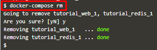

[**Katacoda**](https://www.katacoda.com/courses/docker/11) Orchestration using Docker Compose.

Docker compose adalah alat untuk mendefinisikan dan menjalankan aplikasi Docker multi-kontainer. Docker compose bisa menyimpan konfigurasi dalam file, berarti semua perubahan dependency service, seperti versi database dan service lain dapat dimasukkan dalam VCS (Version Control System).

Docker Compose digunakan untuk menyimpan konfigurasi dalam file, yang artinya semua perubahan dependency service, seperti versi database dan service lain dapat dimasukkan dalam VCS (Version Control System). Dengan VCS dapat lebih mudah men-debug jika terjadi error pada software.

## 1. Mendefinisikan Container pertama

Docker Compose didasarkan pada file docker-compose.yml. File ini mendefinisikan semua kontainer dan pengaturan yang dibutuhkan untuk meluncurkan kumpulan cluster. Perintah dalam docker-compose.yml ini mendefinisikan container yang disebut web, yang didasarkan pada pembangunan direktori saat ini.

Format file didasarkan pada YAML (Yet Another Markup Language).

Dalam skenario ini, kita memiliki aplikasi Node.js yang memerlukan koneksi ke Redis. Untuk memulai, kita perlu mendefinisikan file docker-compose.yml untuk meluncurkan aplikasi Node.js.
Dengan format di atas, file harus memberi nama kontainer 'web' dan mengatur properti build ke direktori saat ini.

## 2. Menentukan Pengaturan

Docker Compose mendukung semua properti yang dapat didefinisikan menggunakan.

Untuk menghubungkan dua container bersama, maka perlu menentukan properti tautan dan mendaftarkan koneksi yang diperlukan.

## 3. Mendefinisikan Container kedua

Container kedua ini menggunakan image yang sudah ada pada Docker Hub. Pada file YML, tambahkan sckrip berikut yang digunakan untuk menggunakan image redis.

## 4. Docker Up

Menjalankan Docker-compose dengan UP

Argumen -d menyatakan untuk menjalankan kontainer di latar belakang, mirip dengan saat digunakan dengan docker run.

## 5. Manajemen Docker

Docker Compose tidak hanya dapat mengelola kontainer awal tetapi juga menyediakan cara mengelola semua kontainer menggunakan satu perintah.

- docker-compose ps digunakan untuk melihat detail container yang diluncurkan.

- docker-compose logs digunakan untuk mengakses semua log.

- docker-compose digunakan untuk menampilkan perintah lain yang dapat digunakan.

## 6. Docker Scale

Karena Docker Compose memahami cara meluncurkan kontainer aplikasi, itu juga dapat digunakan untuk mengukur jumlah kontainer yang berjalan.

Scale option memungkinkan untuk menentukan layanan dan jumlah instance yang diinginkan. Jika angkanya lebih besar dari instans yang sudah berjalan, maka akan meluncurkan kontainer tambahan. Jika jumlahnya kurang, maka itu akan menghentikan kontainer yang tidak diminta.

Kita dapat menurunkannya kembali menggunakan:

## 7. Docker Stop

Seperti ketika meluncurkan aplikasi, untuk menghentikan satu set kontainer, kita dapat menggunakan perintah:

Dan untuk menghapus semua container dapat dilakukan dengan perintah " docker-compose rm ". Akan ada pertanyaan konfirmasi dengan mengetik Y atau N.

