[**Katacoda**](https://www.katacoda.com/courses/docker/getting-started-with-swarm-mode) Docker Orchestration - Getting Started With Swarm Mode

Mode ini memungkinkan pengguna untuk me-deploy container pada multiple hosts atau node, menggunakan overlay network. Swarm mode merupakan bagian dari command line interface Docker yang memudahkan pengguna untuk memanage komponen container apabila sudah familiar dengan command – command yang ada di Docker.

Mode Docker Swarm memperkenalkan tiga konsep :

- **Node** : Node merupakan turunan dari Docker Engine yang terhubung ke Swarm. Node adalah manajer atau pekerja. Manajer menjadwalkan container mana yang akan dijalankan. Pekerja melaksanakan tugas. Secara default, Manajer juga adalah pekerja.

- **Services** : merupakan konsep tingkat tinggi yang berkaitan dengan kumpulan tugas yang akan dieksekusi oleh pekerja. Contoh Server HTTP yang berjalan sebagai Docker Container pada tiga node.

- **Load Balancing** : Load balancing digunakan untuk memproses permintaan di semua kontainer dalam Service.

## 1 - Menginisialisasi Mode Swarm

Ubah satu host host Docker menjadi Mode Swarm Docker Multi-host. Menjadi Manajer secara default, Docker berfungsi sebagai node-tunggal yang terisolasi. Semua kontainer hanya dikerahkan ke mesin. Mode Swarm mengubahnya menjadi mesin multi-host cluster-aware.

Node pertama yang menginisialisasi Mode Swarm menjadi manajer. Ketika node baru bergabung dengan cluster, mereka dapat menyesuaikan peran mereka antara manajer atau pekerja. Kita harus menjalankan 3-5 manajer di lingkungan produksi untuk memastikan ketersediaan tinggi.

Mode Swarm dibangun ke dalam Docker CLI. Anda dapat menemukan gambaran umum tentang kemungkinan perintah:

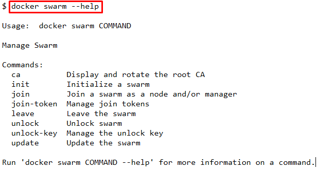

**Pada node-1** jalankan perintah:

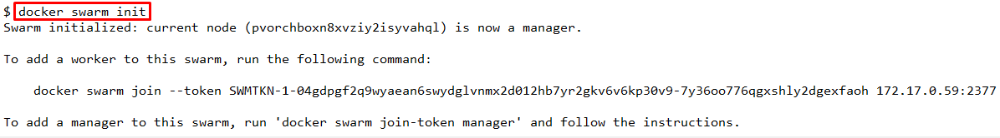

Perintah init digunakan untuk menginisialisasikan node ini sebagai manager.

## 2. Join Cluster

Dengan mengaktifkan Mode Swarm, dimungkinkan untuk menambahkan node tambahan dan mengeluarkan perintah di semuanya. Jika node hilang, misalnya, karena crash, kontainer yang berjalan pada host tersebut akan secara otomatis dijadwal ulang ke node lain yang tersedia. 

Untuk menambahkan node2 kedalam cluster, dilakukan dengan mengarahkan host lain ke manajer cluster saat ini yaitu node-1.

**Pada node-2** jalankan perintah :

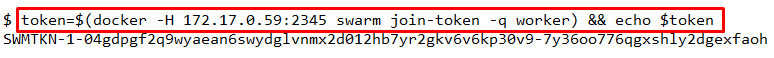

Perintah ini menanyakan kepada manajer apa token itu via swarm join-token.

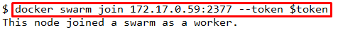

Perintah ini menginisialisasikan node-2 sebagai worker dan join ke cluster swarm.

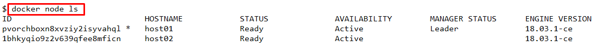

*docker node ls* digunakan untuk menampilkan semua node yang ada dalam cluster.

## 3. Membuat Overlay Network

Overlay network akan berfungsi sebagai media komunikasi antar container yang berbeda host atau node. Untuk me-create overlay network, digunakan perintah :

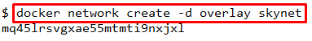

## 4. Deploy Service

Secara default, Docker menggunakan model replikasi penyebaran untuk memutuskan kontainer mana yang harus dijalankan pada host mana. Pendekatan penyebaran memastikan bahwa kontainer digunakan di seluruh cluster secara merata. Ini berarti bahwa jika salah satu node dihapus dari cluster, instance akan sudah berjalan di node lain.

Service digunakan untuk menjalankan container lintas cluster. Dengan memperbarui service ini, Docker juga akan memperbarui kontainer yang diperlukan secara terkelola.

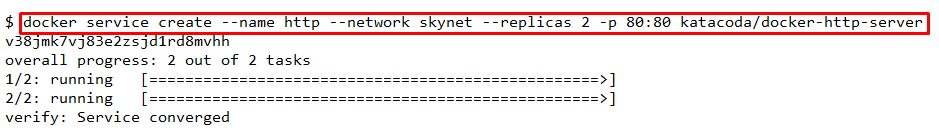

Perintah ini digunakan untuk mendefinisikan service dengan nama http yang dilampirkan dalam jaringan skynet dan menjalankan image katacoda / docker-http-server. Replikasi di buat 2 dan kedua container ini berjalan bersama-sama di port 80. 

Mengirim permintaan HTTP ke salah satu node di cluster akan memproses permintaan dengan salah satu kontainer di dalam cluster. Node yang menerima permintaan mungkin bukan node di mana kontainer merespons. Sebagai gantinya, Docker memuat permintaan keseimbangan di semua kontainer yang tersedia.

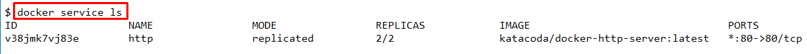

**docker service ls** digunakan untuk menampilkan service yang berjalan pada cluster.

**docker ps** digunakan untuk menampilkan list container. Gambar pertama adalah list container pada node-1 dan gambar ke 2 adalah list container pada node-2.

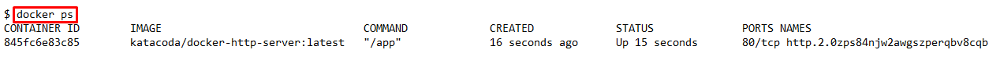

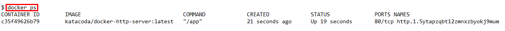

Jika terdapat permintaan HTTP ke port publik, permintaan itu akan diproses oleh kedua kontainer.

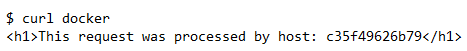

## 5. Inspect State

Konsep Layanan memungkinkan Anda untuk memeriksa kesehatan dan keadaan cluster Anda dan aplikasi yang berjalan. Dalam hal ini, setiap tugas adalah kontainer.

Untuk memeriksa service dan keadaan cluster serta aplikasi yang sudah berjalan, dapat dilakukan dengan perintah :

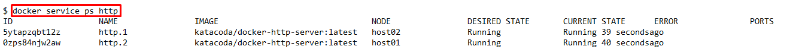

Untuk melihat detail dan configurasi service nya dengan perintah :

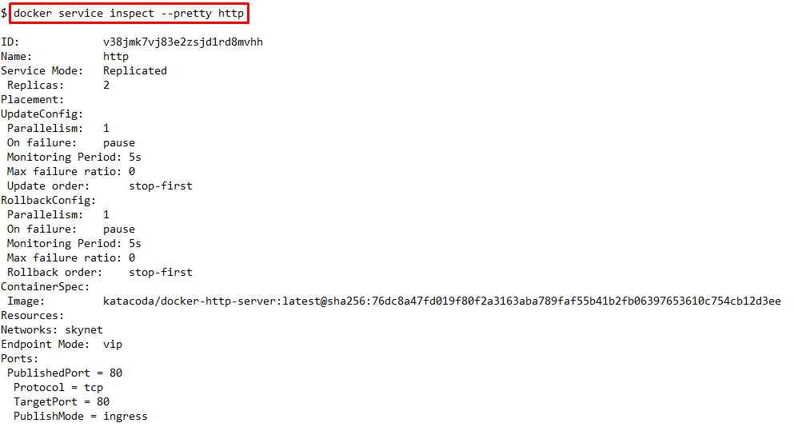

Pada setiap node, dapat diketahui apakah tugas atau task yang sedang dijalankan. SELF merujuk pada manajer node.

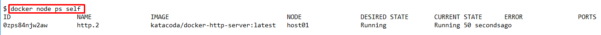

Dengan menggunakan ID sebuah node, dapat dilakukan query dari masing-masing host.

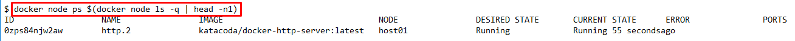

## 6. Scale Service

Layanan memungkinkan kita untuk mengukur berapa banyak contoh tugas yang berjalan di seluruh cluster. Karena memahami cara meluncurkan kontainer dan kontainer mana yang sedang berjalan, ia dapat dengan mudah memulai, atau mengeluarkan, kontainer seperti yang diperlukan. Saat ini penskalaannya adalah manual. Namun, API dapat dihubungkan ke sistem eksternal seperti dasbor metrik.

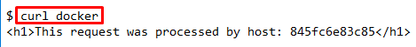

Perintah di bawah ini akan meningkatkan skala layanan http kita untuk berjalan di lima kontainer:

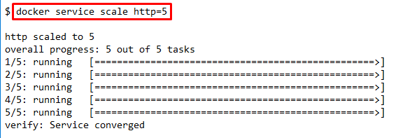

Perintah docker ps digunakan untuk melihat node tambahan yang berjalan.

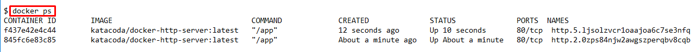