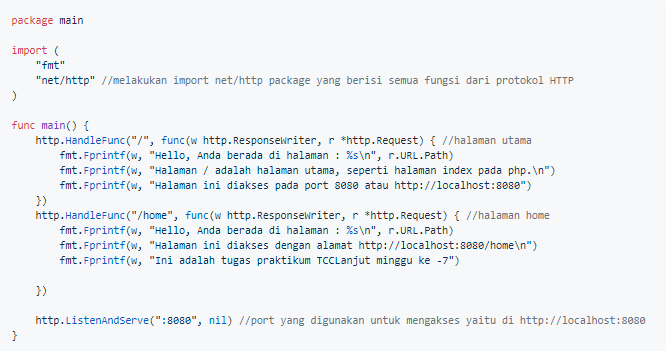
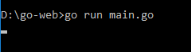
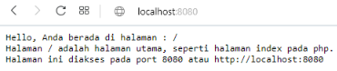
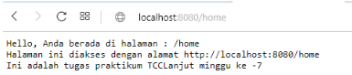

# GoWebExample : menampilkan Hello-world

## 1. Membuat file main.go yang berisi 2 buah halaman.

## 2. Menjalankan file main.go melalui command prompt

## 3. Mengakses halaman utama dari alamat http://localhost:8080

## 4. Mengakses halaman home dari alamat http://localhost:8080/home

- << [BACK](README.md)

