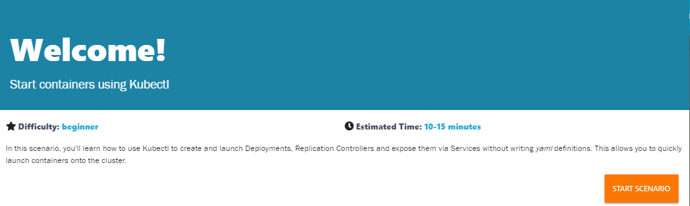

[**Katacoda**](https://www.katacoda.com/courses/kubernetes/kubectl-run-containers) Start containers using Kubectl

Menggunakan Kubectl untuk membuat dan menjalankan Deployment, Kontrol Replikasi, dan mengeksposnya melalui Service tanpa menulis definisi yaml. Sehingga container dapat dijalankan dengan cepat ke dalam kluster.

## 1. Memulai Cluster

	- minikube start : perintah untuk memulai minikube.

	- kubectl get nodes : digunakan untuk mengechek apakah node telah siap

	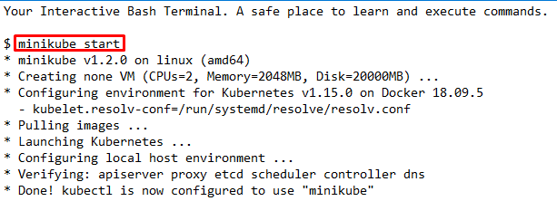
	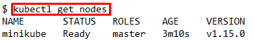

## 2. Menjalankan Kubectl

	Untuk menjalankan Kubectl, digunakan perintah RUN. Syntak perintahnya adalah 
	**kubectl run <name of deployment> <properties>**

	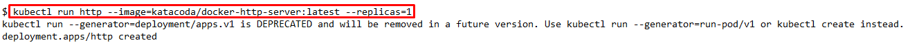

	Untuk melihat status deploymentnya digunakan perintah : **kubectl get deployments**

	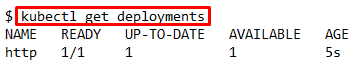

	Dan untuk melihat apa saja yang telah dibuat oleh Kubernetes, proses deployment ini dapat dideskripsikan dengan perintah **kubectl describe deployment http**

	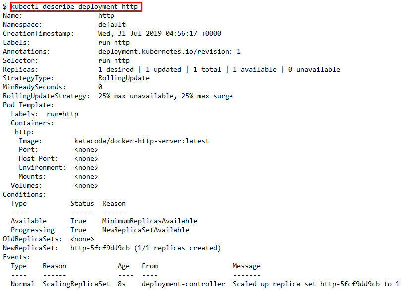

	Dalam deskripsi tersebut menunjukkan berapa banyak replika yang tersedia, label dan event yang terkait.

## 3. Kubectl Expose

	Perintah kubectl expose digunakan untuk menentukan berbagai parameter layanan dan cara mengekspos penyebaran.

	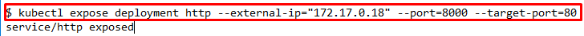
	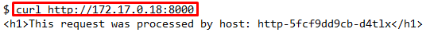

	- perintah ditas digunakan untuk mengekspos port kontainer 80 pada host 8000 yang mengikat ip eksternal host.

	- Perintah curl digunakan untuk melihat hasil dari service HTTP.

## 4. Kubectl Run dan Expose

	Dalam perintah kubectl run, bisa digunakan untuk membuat deployment dan mengeksposenya dengan satu perintah saja.

	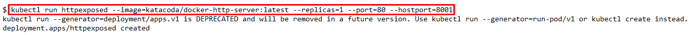
	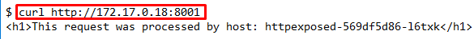
	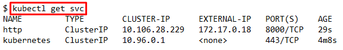
	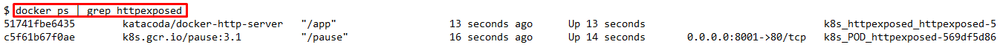

	- Perintah pertama dimaksudkan untuk membuat service kedua dan mengeksposenya pada port 8001.

	- Perintah *kubectl get svc* digunakan untuk melihat service yang terdaftar.

	- Perintah *docker ps | grep httpexposed* digunakan untuk melihat detail dari service. 

## 5. Skala Container

	Pengukuran jumlah replika dari deploymen ini akan meminta Kubernetes untuk meluncurkan Pod tambahan. Pod ini kemudian akan secara otomatis dimuat seimbang menggunakan service yang terbuka.

	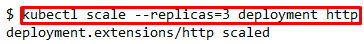

	- Perintah *kubectl scale* digunakan untuk menyesuaikan jumlah Pods yang berjalan pada deployment atau replikasi tertentu.

	- Perintah *kubectl get pods* digunakan untuk melihat list dari semua pod yang berjalan.

	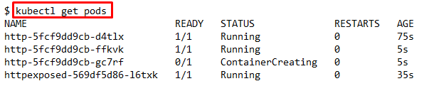
	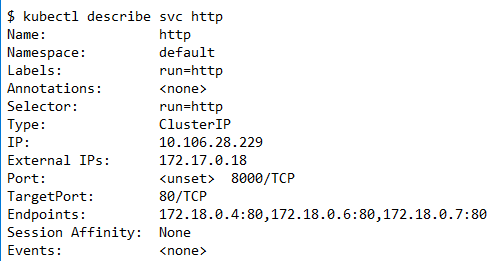

	
	- Perintah *kubectl describe svc http* digunakan untuk mendeskripsikan service dan melihat titik akhir dan pod-pod terkait lainnya.
	
 - << [BACK](README.md)